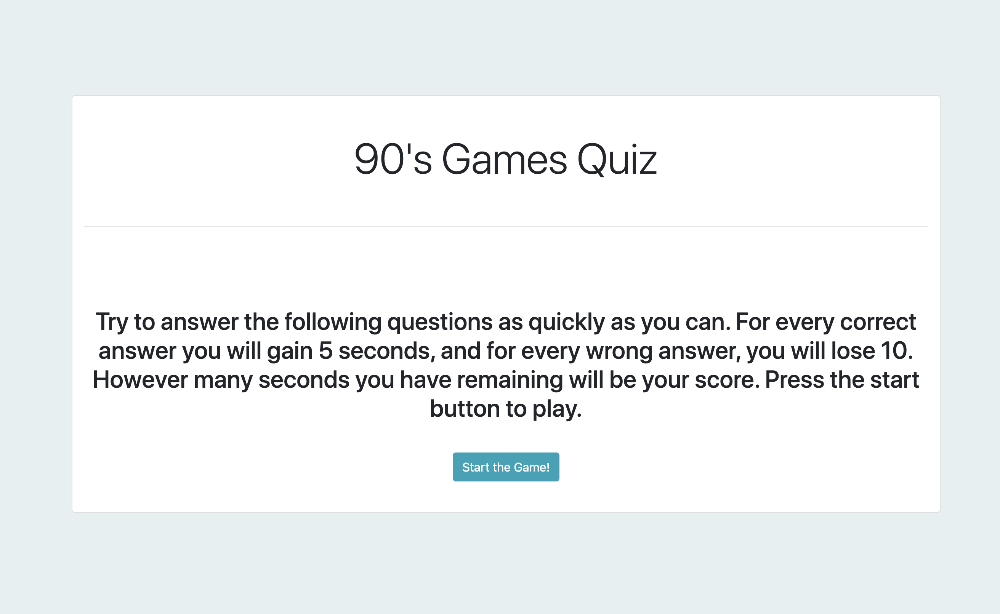
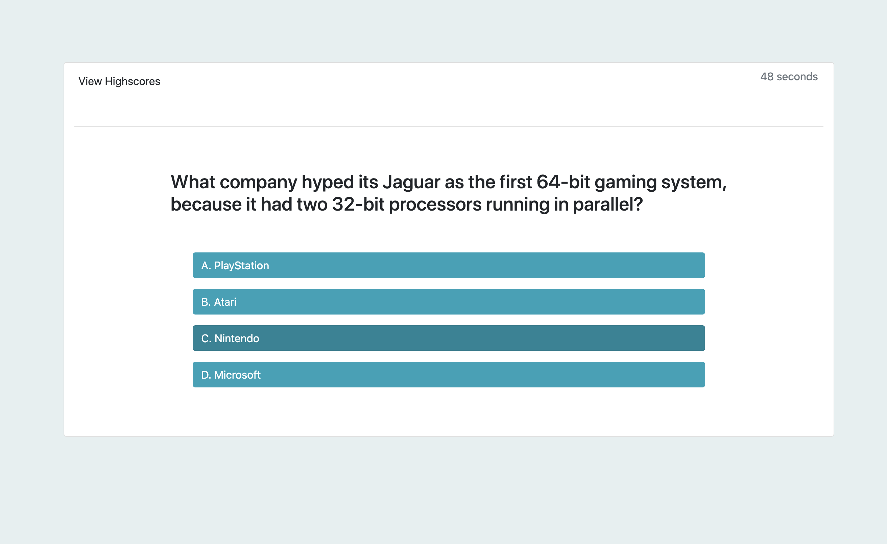
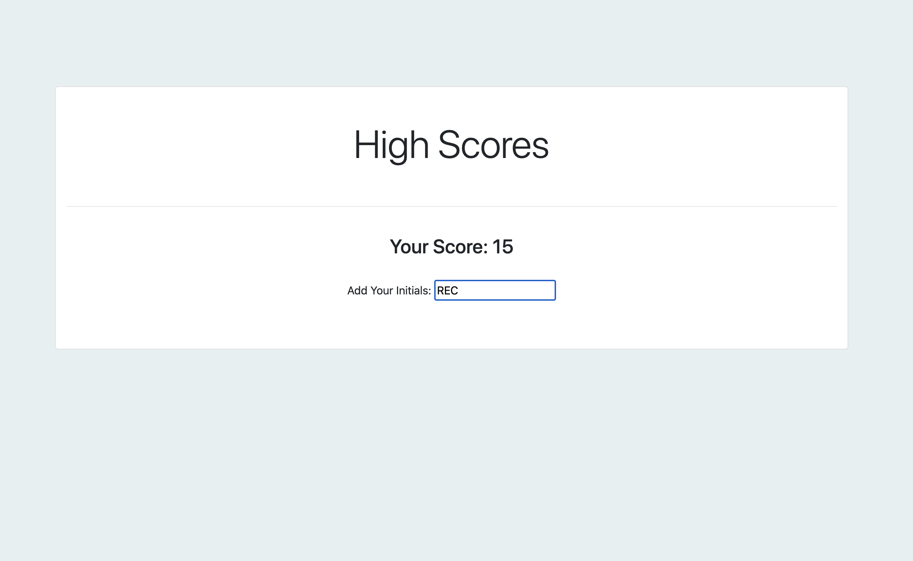

# Code Quiz

Take a timed quiz on 90's console games. For every correct answer you will gain 5 seconds, and for every wrong answer, you will lose 10. However many seconds you have remaining will be your score. Press the start button to play.

## About the Project

For this assignment we were asked to meet the following criteria:

    GIVEN I am taking a code quiz
    WHEN I click the start button
    THEN a timer starts and I am presented with a question
    WHEN I answer a question
    THEN I am presented with another question
    WHEN I answer a question incorrectly
    THEN time is subtracted from the clock
    WHEN all questions are answered or the timer reaches 0
    THEN the game is over
    WHEN the game is over
    THEN I can save my initials and score

### Built With

- <a href="https://getbootstrap.com/">Bootstrap</a>
- <a href="https://developer.mozilla.org/en-US/docs/Web/javascript">JavaScript</a>
- <a href="https://api.jquery.com/">jQuery</a>

## Getting Started

To run the program please visit the <a href="https://relizabet.github.io/Code_Quiz/">Code Quiz</a> page.

### Examples of Program in Use

### Notes

- I was unable to complete the high score page in time.

## Authors

- **Rachel Campbell** - _complete work_ - [relizabet](https://github.com/relizabet)

## Acknowledgements

- <a href="https://github.com/othneildrew/Best-README-Template">Othneildrew for this README template</a>
- <a href="https://developer.mozilla.org/en-US/">Mozilla Developer Network</a>
